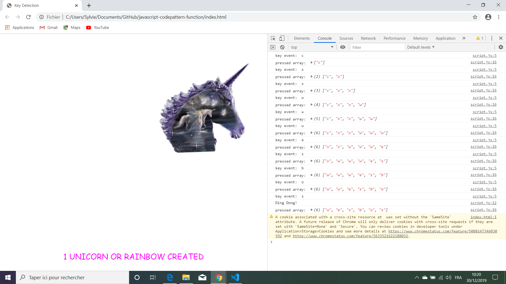

# Javascript30 Tutorial Codepattern Function

* Wes Bos Youtube Tutorial: [JavaScript KONAMI CODE! #JavaScript30 12/30](https://www.youtube.com/watch?v=_A5eVOIqGLU).

*** Note: to open web links in a new window use: _ctrl+click on link_**

## Table of contents

* [General info](#general-info)
* [Screenshots](#screenshots)
* [Technologies](#technologies)
* [Setup](#setup)
* [Features](#features)
* [Status](#status)
* [Inspiration](#inspiration)
* [Contact](#contact)

## General info

* Uses javascript to detect a sequence of keys. A function is run to show a unicorn if the sequence is detected.

## Screenshots

.

## Technologies

* [Javascript v1.9 ECMA-262 ECMAScript 2018](http://www.ecma-international.org/publications/standards/Ecma-262.htm)

## Setup

* Open index.html in browser. If any code is changed the browser needs to be refreshed.

## Code Examples

* Code to check a sequence of keys is the same as a defined string constant.

```javascript
  // join letters to make a string then check if it is the same as the secret code
  if (pressed.join('').includes(secretCode)) {
    console.log('Ding Dong!');
    cornify_add();
  }
```

## Features

* A unicorn is shown if the sequence is typed correctly.

## Status & To-Do List

* Status: Working. Updated to work from browser, not from Glitch.

* To-Do: Nothing. Could use a response header to avoid the warning from the unicorn site but not urgent.

## Inspiration

* Wes Bos Youtube Tutorial: [JavaScript KONAMI CODE! #JavaScript30 12/30](https://www.youtube.com/watch?v=_A5eVOIqGLU)

## Contact

Repo created by [ABateman](https://www.andrewbateman.org) - feel free to contact me!